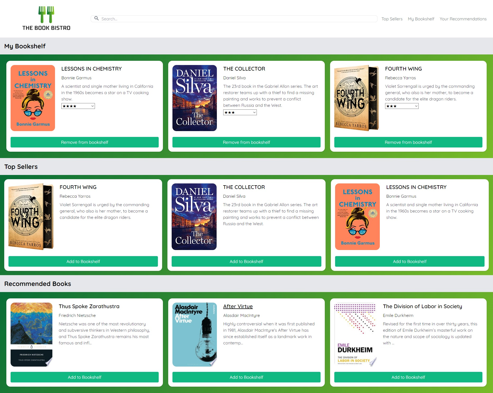

# The Book Bistro

An application that allows users to browse books that are called from both the Google Books and New York Times APIs. Users can search for books using the search query bar and receive information such as title, author, and description, as well as have the option to save books to their bookshelf. Saved books can then be viewed at any time as well as rated, with the ratings being used to automatically generate books in the recommended books section. The application also features a top sellers page which draws upon the New York Times API to display the top selling books of a variety of categories such as genre and book type (paperback/hard cover).

# Deployed Application Link

https://notuneeven.github.io/Book-Bistro-Website

# Deployed Application Screenshot

